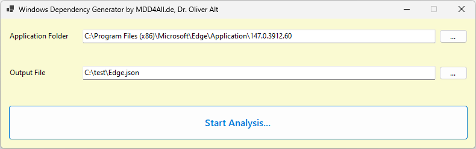
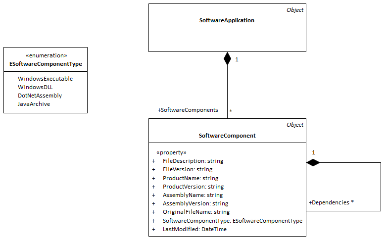

# MDD4All.DependencyAnalysis.Apps.WinForms
[](https://github.com/oalt/MDD4All.DependencyAnalysis.Apps.WinForms/actions/workflows/frontend-publish-snapshot.yml)



With this small tool you can analyze the executables (EXE) and libraries (DLL) and its dependencies of a Windows software application and save the result 
into a JSON file. Such data can be helpfull for example to create a Software Bill of Materials (SBOM).

Select a directory (Application folder) where the executables and the DLLs are included and an output file. By pressing the "Start Analysis..." 
button the analysis starts and the result is saved to the JSON file.

## Get the tool

You can download the tool as result of the GitHub Action [*Build frontend snapshot*](https://github.com/oalt/MDD4All.DependencyAnalysis.Apps.WinForms/actions/workflows/frontend-publish-snapshot.yml) in this project.

## The Data Model

The resulting JSON is based on a simple data model as shown in the class diagram below:

## An example result

Here is an example result, generated from an MS Edge installation
```JSON
{
  "SoftwareComponents": [
    {
      "SoftwareComponentType": "WindowsExecutable",
      "FileDescription": "Microsoft Edge",
      "FileVersion": "147.0.3912.60",
      "ProductName": "Microsoft Edge",
      "ProductVersion": "147.0.3912.60",
      "LastModified": "2026-04-10T09:15:44.8100656+02:00",
      "OriginalFileName": "cookie_exporter.exe",
      "Dependencies": []
    },
    {
      "SoftwareComponentType": "WindowsExecutable",
      "FileDescription": "Microsoft Edge",
      "FileVersion": "147.0.3912.60",
      "ProductName": "Microsoft Edge",
      "ProductVersion": "147.0.3912.60",
      "LastModified": "2026-04-10T09:16:08.5949672+02:00",
      "OriginalFileName": "elevated_tracing_service.exe",
      "Dependencies": []
    },
    {
      "SoftwareComponentType": "WindowsExecutable",
      "FileDescription": "Microsoft Edge",
      "FileVersion": "147.0.3912.60",
      "ProductName": "Microsoft Edge",
      "ProductVersion": "147.0.3912.60",
      "LastModified": "2026-04-10T09:15:44.8256964+02:00",
      "OriginalFileName": "elevation_service.exe",
      "Dependencies": []
    },
    {
      "SoftwareComponentType": "WindowsExecutable",
      "FileDescription": "PWA Identity Proxy Host",
      "FileVersion": "147.0.3912.60",
      "ProductName": "Microsoft Edge",
      "ProductVersion": "147.0.3912.60",
      "LastModified": "2026-04-10T09:15:57.1540807+02:00",
      "OriginalFileName": "identity_helper.exe",
      "Dependencies": []
    },
    {
      "SoftwareComponentType": "WindowsExecutable",
      "FileDescription": "Copilot",
      "FileVersion": "147.0.3912.60",
      "ProductName": "Copilot",
      "ProductVersion": "147.0.3912.60",
      "LastModified": "2026-04-10T09:16:23.1265098+02:00",
      "OriginalFileName": "mscopilot.exe",
      "Dependencies": []
    },
    {
      "SoftwareComponentType": "WindowsExecutable",
      "FileDescription": "Microsoft Edge",
      "FileVersion": "147.0.3912.60",
      "ProductName": "Microsoft Edge",
      "ProductVersion": "147.0.3912.60",
      "LastModified": "2026-04-10T09:15:57.2790769+02:00",
      "OriginalFileName": "msedge.exe",
      "Dependencies": []
    },
...
```

